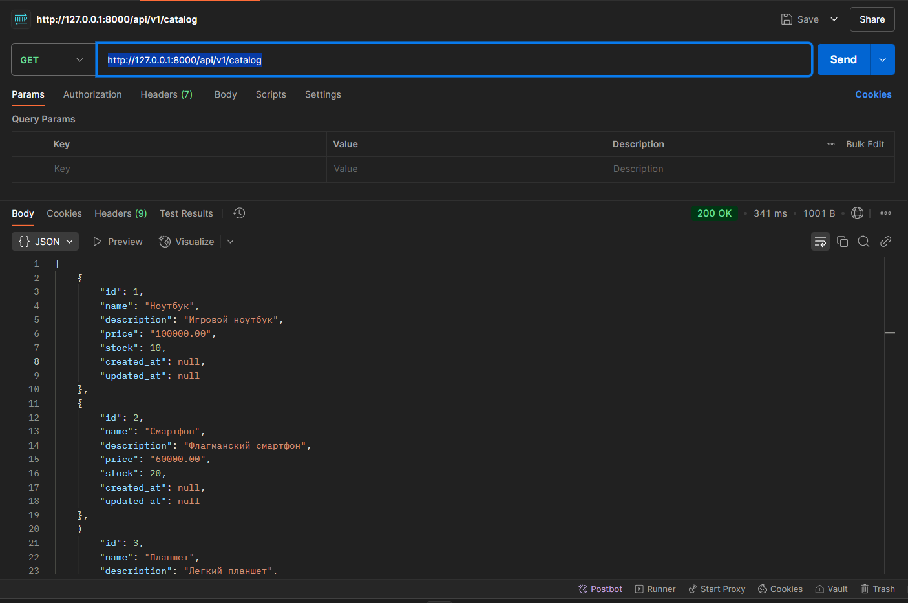
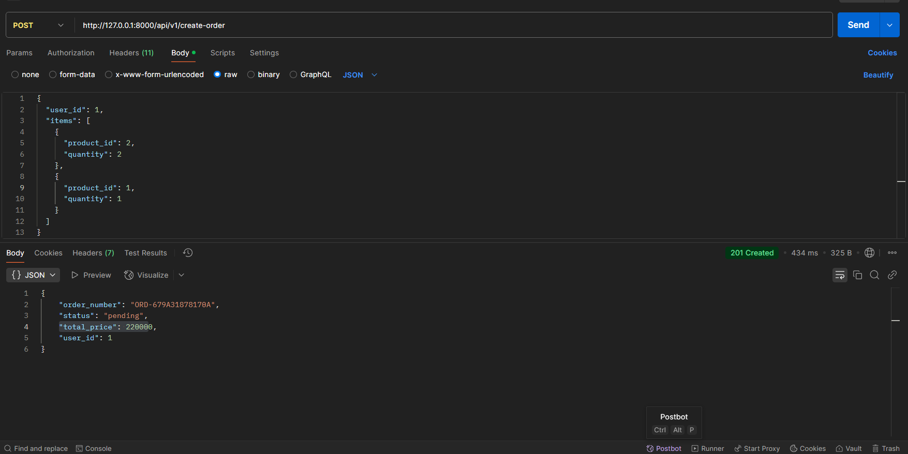
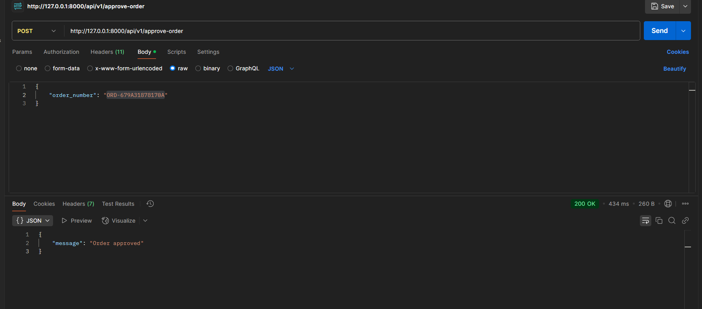

# E-commerce API

Это RESTful API для онлайн-магазина, разработанный на Laravel, с возможностью оформления заказов, учета остатков товаров, расчета общей стоимости и валидации данных.

## Описание

Этот проект предоставляет API для онлайн-магазина, включающего функционал:

- Получение каталога товаров.
- Оформление заказа с указанием товаров и их количества.
- Подтверждение заказа после проверки наличия достаточного баланса у пользователя.

Проект использует Laravel для реализации бизнес-логики и работы с базой данных MySQL.

## Функции

1. **Каталог товаров**

   - `GET /api/v1/catalog` - Получить список товаров.
2. **Оформление заказа**

   - `POST /api/v1/create-order` - Создать заказ с указанными товарами и их количеством.
3. **Подтверждение заказа**

   - `POST /api/v1/approve-order` - Подтвердить заказ и списать средства с баланса пользователя.

## Структура проекта

### Модели

- **User**: Модель пользователя.
- **Product**: Модель товара.
- **Order**: Модель заказа.
- **OrderItem**: Модель позиции в заказе.

### Контроллеры

- **CatalogController**: Контроллер для отображения каталога товаров.
- **OrderController**: Контроллер для работы с заказами.

## Использование API:

### Получение каталога товаров

- **URL**: `/api/v1/catalog`
- **Метод**: `GET`
- **Ответ**:
  ```json
  [
      {
          "id": 1,
          "name": "Product 1",
          "price": 100,
          "stock": 10
      },
      {
          "id": 2,
          "name": "Product 2",
          "price": 200,
          "stock": 5
      }
  ]
  ```

### Создание заказа

- **URL**: `/api/v1/create-order`
- **Метод**: `POST`
- **Тело запроса**:
  ```json
  {
      "user_id": 1,
      "items": [
          {
              "product_id": 1,
              "quantity": 2
          },
          {
              "product_id": 2,
              "quantity": 1
          }
      ]
  }
  ```
- **Ответ**:
  ```json
  {
      "order_number": "ORD-1234567890",
      "user_id": 1,
      "status": "pending",
      "total_price": 300,
      "created_at": "2025-01-29T12:30:00",
      "updated_at": "2025-01-29T12:30:00"
  }
  ```

### Подтверждение заказа

- **URL**: `/api/v1/approve-order`
- **Метод**: `POST`
- **Тело запроса**:

  ```json
  {
      "order_number": "ORD-1234567890"
  }
  ```
-
- **Ответ**:

  ```json
  {
      "message": "Order approved"
  }
  ```










## Лицензия

Этот проект имеет открытую лицензию MIT. Подробнее см. в файле [LICENSE](LICENSE).
